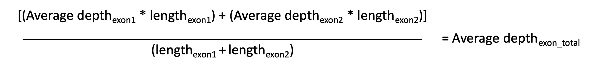
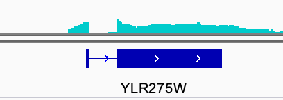
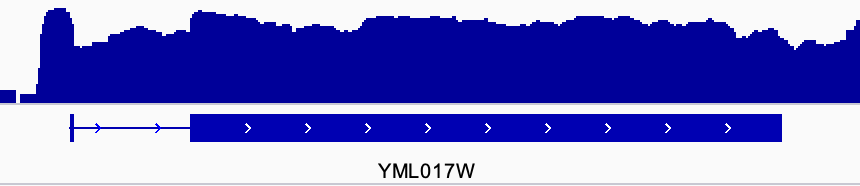
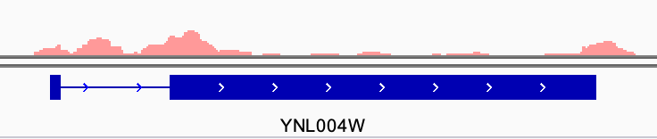
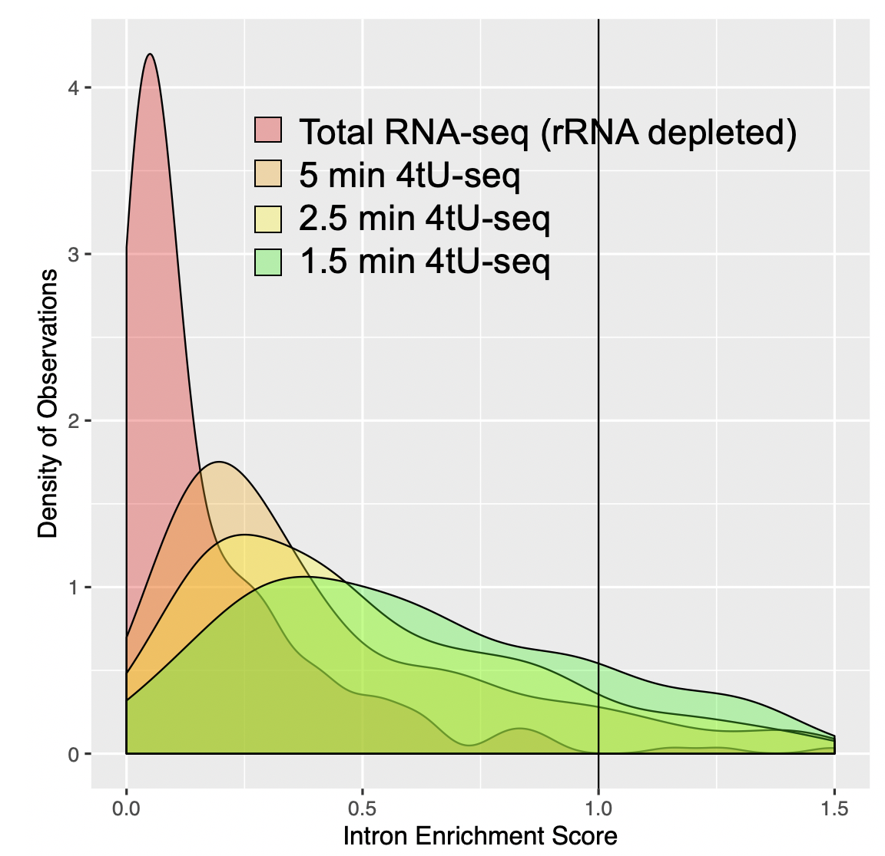

# Intron_Enrichment_Score

## Usage 
The intron enrichment score (IES) is used to calculate the relative enrichment of intronic reads to neighboring exonic reads for genomic loci in Saccharomyces cerevisiae. 
Input for the analysis is a folder of bigwig files. 

These scripts first calculate the average coverage over exon and intron regions using the multiBigwigSummary command from deeptools. 

Then, after import to R, coverage over multiple exons are averaged to get a single exonic read depth (repeated for introns).


Finally, IES is calculated as the ratio of average intronic coverage to average exonic coverage 


IES < 1 indicates lower average intronic coverage than average exonic coverage 



IES ≈ 1 indicates roughly equal average intronic and  exonic coverage 



IES > 1 indicates greater average intronic coverage than average exonic coverage 


## Implementation 
1. Place all bigwigs for analysis in a single folder.

2. Open the file "src/CalculatingIntronandExonCoverage.sh" and change the variable "bigwigfolder" to the name of the folder holding bigwigs for analysis.

3. Execute the script "CalculatingIntronandExonCoverage.sh" form the src folder.

```./CalculatingIntronandExonCoverage.sh```

4. Open the R script and edit the sample names to fit the samples you have. Import the tab files and use the line below to confirm sample order is as expected. Change the "column_names" variable to reflect the sample order. 


5. Execute the script up until IES is generated and display data as you please. 

Example IES Analysis:



## Contributing
Pull requests are welcome. For major changes, please open an issue first to discuss what you would like to change.

Please make sure to update tests as appropriate.


## Dependencies
Applications used in this analysis include deeptools (v3.3.2) and bedtools (v2.28.0). 
